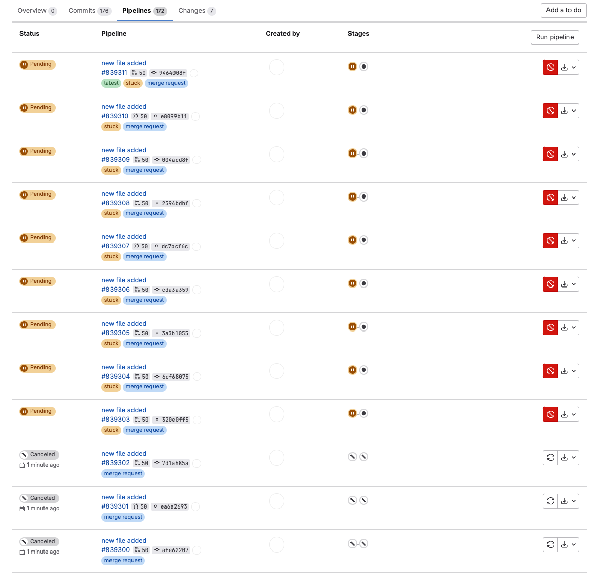
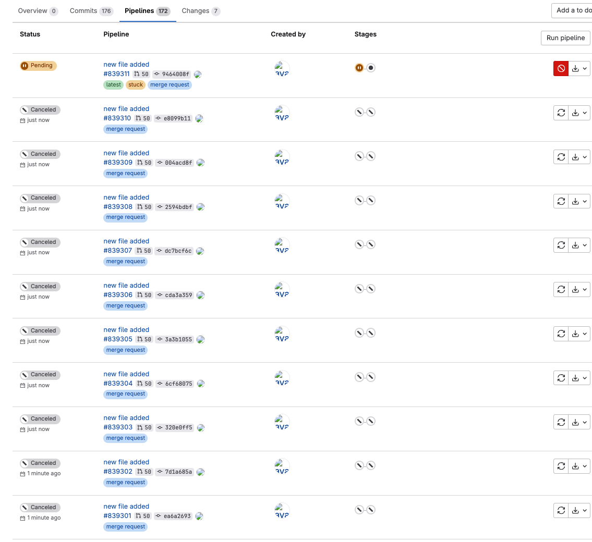

# Go GitLab Redundant Pipeline Cleaner 🚀

<p align="center">
  
</p>

🌟 A powerful and efficient Golang application designed to clean up redundant pipelines in GitLab repositories using webhooks. This tool is perfect for automating the cancellation of unnecessary CI/CD pipelines triggered by merge requests, optimizing your team's workflow and saving valuable resources.

---

## How It Works
When a new merge request (MR) is updated, the tool scans for active pipelines associated with the MR. If multiple pipelines are found, the tool cancels all but the most recent pipeline, ensuring that only the latest pipeline continues running.

## Before and After Example

### Identifying Redundant Pipelines
The tool identifies multiple active pipelines that are running for the same merge request. Below is an example screenshot showing **redundant pipelines** triggered by multiple updates to the same MR:



In this screenshot, you can see that several pipelines were triggered by different updates. However, only the most recent pipeline is necessary, as previous ones are now outdated.

### Canceling Redundant Pipelines
After running the tool, redundant pipelines are automatically canceled, leaving only the most recent pipeline active. This helps to free up resources and reduce clutter in the CI/CD pipeline list.

Here’s a screenshot showing the **result after running the tool**:



As you can see, the tool successfully canceled the redundant pipelines, leaving only the latest one running.

## 📚 Introduction

With the continuous integration and deployment practices, it's common to have multiple pipelines triggered for various merge request actions. This application leverages GitLab webhooks to cancel redundant pipelines, especially useful for preventing unnecessary tasks on merge request updates.

This README provides comprehensive details about setting up, operating, and understanding the application.

---

## 📦 Project Structure

Here's an overview of the project structure:

```
go-gl-redundant-pipeline-cleaner
├── Dockerfile
├── cmd
│   └── main.go
├── docker-compose.yml
├── go.mod
├── go.sum
└── internal
    ├── config
    │   └── config.go
    ├── gitlab
    │   └── client.go
    ├── handlers
    │   └── webhook.go
    ├── middleware
    │   └── auth.go
    └── utils
        ├── logger.go
        └── utils.go
```

### Key Files

- **cmd/main.go**: The entry point of the application.
- **Dockerfile**: For building the Docker image.
- **docker-compose.yml**: Defines services, networks, and volumes for Docker Compose.
- **internal/config/config.go**: Manages application configuration.
- **internal/gitlab/client.go**: GitLab client to interact with GitLab API.
- **internal/handlers/webhook.go**: Handles incoming webhook requests.
- **internal/middleware/auth.go**: Provides authentication middleware.
- **internal/utils/utils.go**: Contains utility functions.

---

## ⚙️ Installation and Setup

### Prerequisites

- Go 1.23.1 or higher
- Docker
- GitLab account with API access

### Go Setup

To get started, clone the repository and install the required Go dependencies:

```bash
git clone https://github.com/alekseiapa/go-gl-redundant-pipeline-cleaner.git
cd go-gl-redundant-pipeline-cleaner
go mod download
```

### Environment Variables

Create a `.env` file in the project root directory with the following variables:

```plaintext
GITLAB_WEBHOOK_SECRET=your-webhook-secret
GITLAB_API_TOKEN=your-gitlab-api-token
GITLAB_URL=https://gitlab.com
GITLAB_PROJECT_ID=your-gitlab-project-id
```

### Docker Setup

Create a network:

```bash
docker network create traefik_net_webhook
```

Build and run the application using Docker:

```bash
docker-compose up --build
```

Expose port `5001` to receive webhook notifications.

---

## 🚀 Quickstart

This application listens on port 5001 for GitLab webhooks and processes merge request events to cancel redundant pipelines.

```go
package main

import (
    "github.com/alekseiapa/go-gl-redundant-pipeline-cleaner/internal/config"
    "github.com/alekseiapa/go-gl-redundant-pipeline-cleaner/internal/gitlab"
    "github.com/alekseiapa/go-gl-redundant-pipeline-cleaner/internal/handlers"
    "github.com/alekseiapa/go-gl-redundant-pipeline-cleaner/internal/middleware"
    "log"
    "net/http"
    "os"
)

func main() {
    cfg := config.LoadConfig()

    logger := log.New(os.Stdout, "webhook-listener", log.LstdFlags|log.Lshortfile)
    if cfg.GitlabAPIToken == "" || cfg.GitlabWebhookSecret == "" || cfg.GitlabProjectID == "" {
        logger.Fatal("Missing required environment variables.")
    }
    gitlabClient, err := gitlab.NewGitlabClient(cfg, logger)
    if err != nil {
        logger.Fatal("failed to initialize gitlab client: %v", err)
    }
    webhookHandler := handlers.NewWebhookHandler(cfg, gitlabClient, logger)
    authMiddleware := middleware.AuthMiddleware(cfg, logger)
    http.Handle("/cancel-redundant-pipelines", authMiddleware(http.HandlerFunc(webhookHandler.HandleWebhook)))

    log.Println("Starting server on port 5001...")
    if err := http.ListenAndServe(":5001", nil); err != nil {
        log.Fatalf("Server failed to start: %v", err)
    }
}
```

---

## 🔒 Authentication

The application uses a middleware to validate incoming requests via the `X-Gitlab-Token` header. Ensure that the provided token matches the one set in `GITLAB_WEBHOOK_SECRET` to authorize requests.

### AuthMiddleware

```go
func AuthMiddleware(cfg *config.Config, logger *log.Logger) func(http.Handler) http.Handler {
    return func(next http.Handler) http.Handler {
        return http.HandlerFunc(func(w http.ResponseWriter, r *http.Request) {
            token := strings.TrimSpace(r.Header.Get("X-Gitlab-Token"))
            if token == "" {
                logger.Println("Missing X-Gitlab-Token header in the request")
                http.Error(w, "Unauthorized: missing X-Gitlab-Token header", http.StatusUnauthorized)
                return
            }
            if token != cfg.GitlabWebhookSecret {
                logger.Println("Invalid X-Gitlab-Token header in the request")
                http.Error(w, "Unauthorized: invalid X-Gitlab-Token header", http.StatusUnauthorized)
                return
            }
            logger.Printf("Authorized request: %s %s", r.Method, r.URL.Path)
            next.ServeHTTP(w, r)
        })
    }
}
```

---

## 🔀 GitLab Client

Interacts with GitLab via the GitLab API to fetch and manage pipelines linked to merge requests. It sorts pipelines and determines which ones are redundant, then cancels them.

### Usage

- **ListPipelinesByMR**: Retrieves pipelines for a specific merge request.
- **CancelRedundantPipelinesByMR**: Cancels pipelines that are redundant, optimizing resource usage.

### Example

```go
func (gc *GitlabClient) CancelRedundantPipelinesByMR(mrId int, mrAction string) error {
    // Allow the pipeline to be created
    time.Sleep(80 * time.Second)

    pipelines, err := gc.ListPipelinesByMR(mrId)
    if err != nil {
        return fmt.Errorf("failed to fetch the pipelines for MR %d: %v", mrId, err)
    }

    // Logic to filter and cancel redundant pipelines
    // ...
    return nil
}
```

---

## 🛠️ Utilities

### Retry Logic

A utility function to implement retry logic with exponential backoff for certain operations.

```go
func Retry(maxAttempts int, initialDelay time.Duration, fn func() error) error {
    var err error
    delay := initialDelay

    for attempt := 1; attempt <= maxAttempts; attempt++ {
        err = fn()
        if err == nil {
            return nil
        }
        log.Printf("attempt %v/%v failed: %v", attempt, maxAttempts, err)

        // exponential backoff
        time.Sleep(delay)
        delay *= 2
    }
    return errors.New("max retry attempts exceeded")
}
```

---

## 🧑‍💻 Development

Contributions are welcome! Feel free to report issues or submit pull requests. Make sure to follow the project's coding standards and run tests before committing changes.

### Makefile Commands

Here are some common `Makefile` commands for development:

- **make help**: Display available commands.
- **make audit**: Conduct quality checks.
- **make coverage**: Generate test coverage report.
- **make format**: Automatically format code.
- **make lint**: Run lint checks.
- **make tidy**: Tidy dependencies.

---

## 📜 License

This project is licensed under the MIT License. 

---

## 🙌 Contributing

We appreciate your feedback and contributions! Here’s how you can get involved:

1. Star the repository ⭐
2. Submit feature requests and bug reports
3. Create pull requests for improvements

Thank you for using the Go GitLab Redundant Pipeline Cleaner! Your efforts in optimizing CI/CD pipelines are very much valued. 😄

---

## 📝 Contact

For more information, visit the [GitHub Repository](https://github.com/alekseiapa/go-gl-redundant-pipeline-cleaner) or contact the maintainer.

---

🎉 Happy coding and automating GitLab pipelines!
